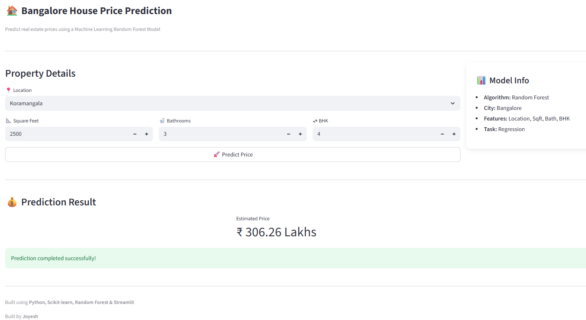

# 🏠 Bangalore House Price Prediction

A Machine Learning web application that predicts house prices in Bangalore using a **Random Forest Regression model** and an interactive **Streamlit dashboard**.

Built as an end-to-end ML project covering data cleaning, feature engineering, model training, and deployment.

---

## 🚀 Live Features

✅ Data Cleaning Pipeline  
✅ Feature Engineering & Outlier Removal  
✅ Random Forest Regression Model  
✅ Interactive Streamlit Web App  
✅ Location Dropdown Prediction Interface  
✅ Modular Production-Style Project Structure

---

## 📸 Application Preview

---

## 🧠 Machine Learning Workflow

1. Data preprocessing and cleaning
2. Feature engineering
3. One-hot encoding of locations
4. Outlier removal
5. Model training using Random Forest Regressor
6. Model serialization using Joblib
7. Deployment with Streamlit

---

## 🛠 Tech Stack

- **Python**
- **Pandas**
- **NumPy**
- **Scikit-learn**
- **Random Forest Regressor**
- **Streamlit**
- **Joblib**

---

## 📂 Project Structure
